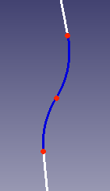

# Path follower

A test implementation of the bare metal path follower for the robot I'm making for my company, Horse Robotics.

Inspired by pure pursuit but uses a curved path like the one in blue below to get to the next point, which also allows it to calculate its speeds based on acceleration limits.

  

The main function is pretty hacky cause I was too lazy to write proper test cases, but it runs. Just install 'UnitAlg' from my profile and run PathFollowerPlaying.py.